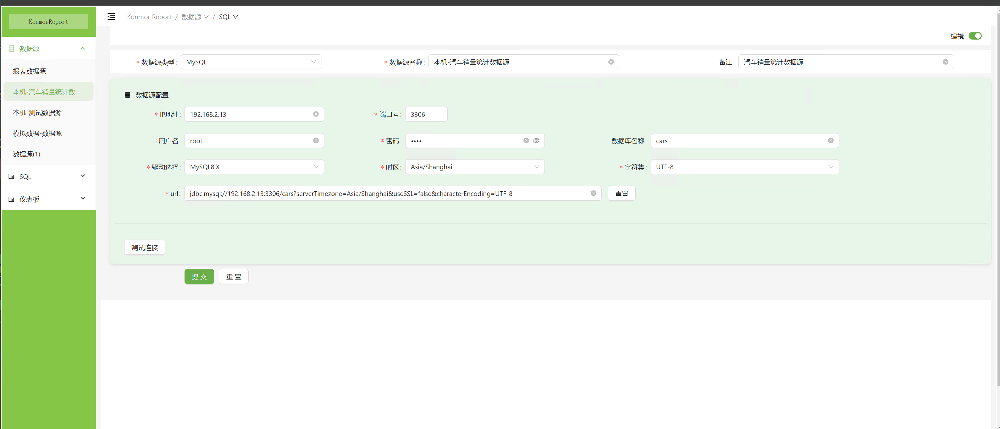
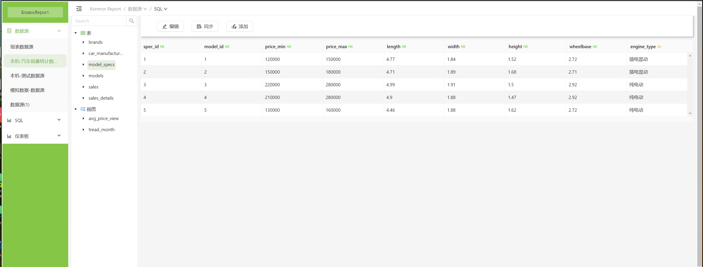
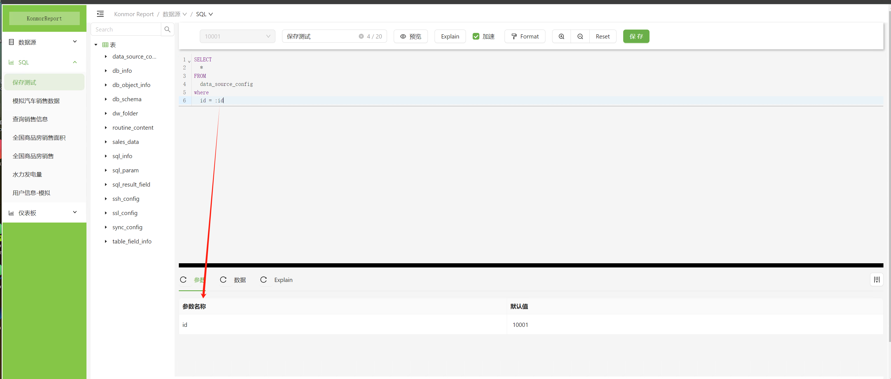
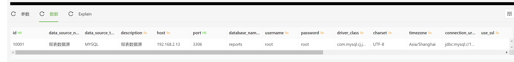
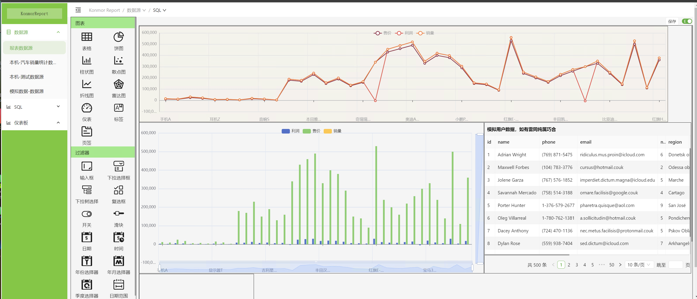
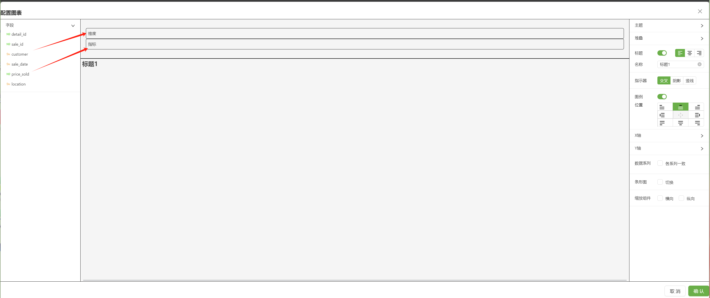
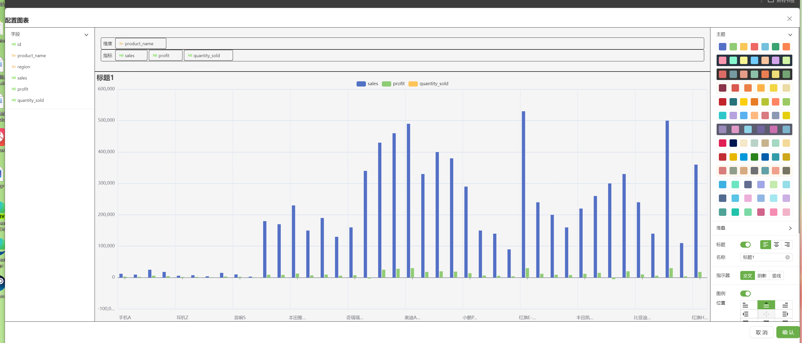
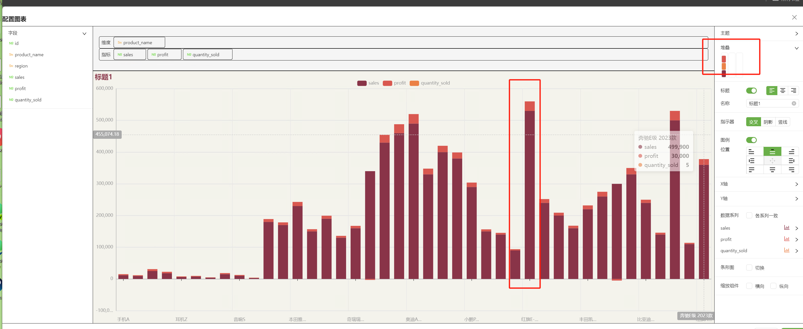
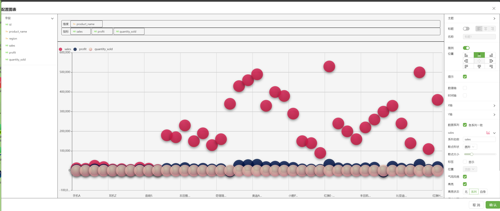
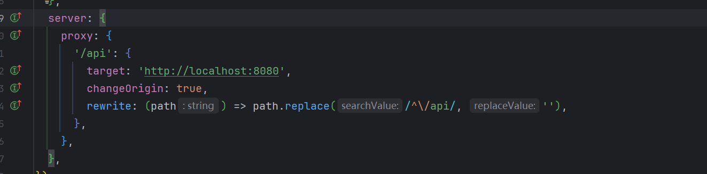

# KonmorReport

## 介绍

用于创建各类可视化图表 包含 柱状图、条形图、折线图、饼图、散点图、雷达图、仪表、标签、表格。其中包含各种变种如
柱状图中可设置为折线图，饼图可调整为环形图、南丁格尔图，仪表可调整为进度条样式，表格可根据数据呈现柱状进度条或电池条等等，等你探索。

## 开源初衷

让二维数据可视化变得简单、易用、好用

## 功能模块

### 数据源

- 可新增、修改、测试连接
  
- 查看数据源的数据
  

### SQL

- 新增、编辑、查看sql数据、解释执行以及添加参数等
  
- 

### 仪表板

- 创建、编辑仪表板
- 可通过拖拽的方式自由布局和放大图表
- 总览
  

#### 柱状图



- 可切换主题
  
- 拖拽堆叠
  
  
- 调整标题、标题位置、标题内容
- 内容过多不举例了

### 散点图

- 可切换主题、调整标题和图里位置 等等
  

## 部署

### 调整好后端地址即可

- 代码位置 [vite.config.ts](vite.config.ts)
- 

```sh
npm install
```

```sh
npm run build
```

## 开发进度

#### 25年3月 - 25年7月

| 内容                         | 进度   | 难度 | 优先级     |
|----------------------------|------|----|---------|
| MySQL 8 数据源 新增、修改          | 100% | 容易 | Level 3 |
| MySQL 8 sql查询，表格、视图查询、参数查询 | 100% | 容易 | Level 3 |
| 仪表版 新增、修改、删除               | 0%   | 容易 | Level 2 |
| 仪表板 拖拽布局、拖拽放大              | 100% | 中等 | Level 2 |
| 仪表板 柱状图                    | 100% | 中等 | Level 2 |
| 仪表板 条形图                    | 100% | 中等 | Level 2 |
| 仪表板 折线图                    | 100% | 中等 | Level 2 |
| 仪表板 饼图                     | 100% | 中等 | Level 2 |
| 仪表板 仪表                     | 100% | 中等 | Level 2 |
| 仪表板 表格                     | 100% | 中等 | Level 2 |
| 仪表板 标签                     | 100% | 中等 | Level 2 |
| 仪表板 散点图                    | 100% | 中等 | Level 2 |
| 仪表板 雷达图                    | 100% | 中等 | Level 2 |
| 仪表板 页签                     | 0%   | 中等 | Level 2 |
| 数据二次聚合、过滤、计算               | 0%   | 难  | Level 2 |
| 过滤器 输入框（数字、字符串）            | 0%   | 中等 | Level 2 |
| 过滤器 下拉框                    | 0%   | 中等 | Level 2 |
| 过滤器 下拉树                    | 0%   | 中等 | Level 2 |
| 过滤器 复选框                    | 0%   | 中等 | Level 2 |
| 过滤器 开关                     | 0%   | 容易 | Level 2 |
| 过滤器 滑块                     | 0%   | 容易 | Level 2 |
| 过滤器 日期                     | 0%   | 中等 | Level 2 |
| 过滤器 时间                     | 0%   | 中等 | Level 2 |
| 过滤器 年份                     | 0%   | 中等 | Level 2 |
| 过滤器 年月                     | 0%   | 中等 | Level 2 |
| 过滤器 季度                     | 0%   | 中等 | Level 2 |
| 过滤器 日期范围                   | 0%   | 中等 | Level 2 |
| 过滤器 年月范围                   | 0%   | 中等 | Level 2 |
| 过滤器 自定义范围                  | 0%   | 中等 | Level 2 |
| 联动、钻取                      | 0%   | 难  | Level 2 |
| 数据仓储                       | 0%   | 难  | Level 3 |
| 数据仓储适配：聚合过滤，联动钻取           | 0%   | 难  | Level 2 |

